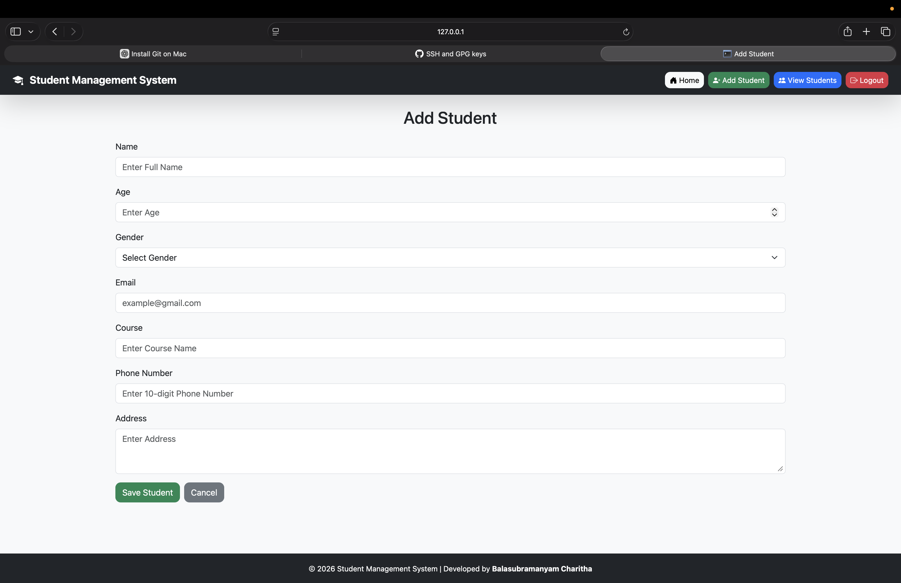
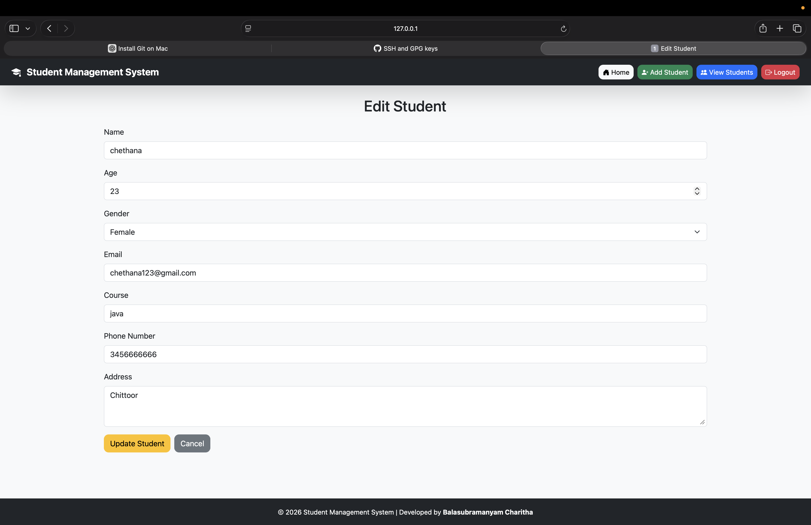
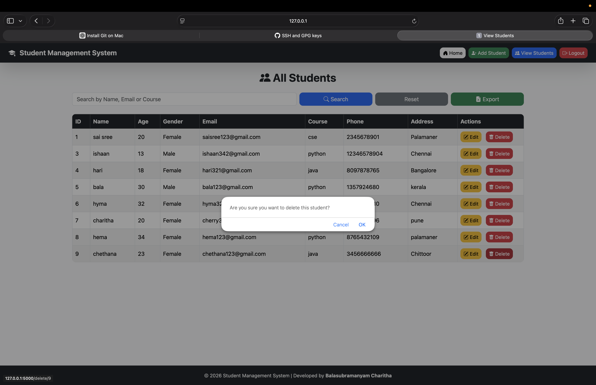
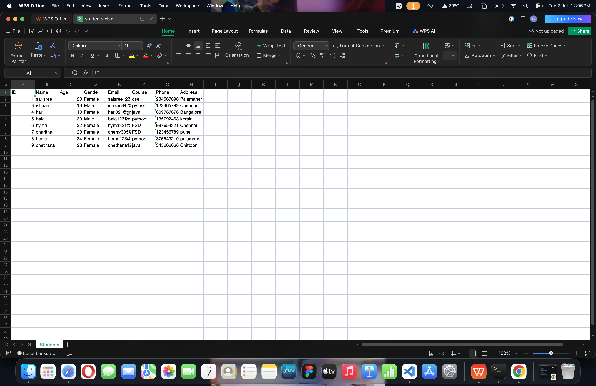
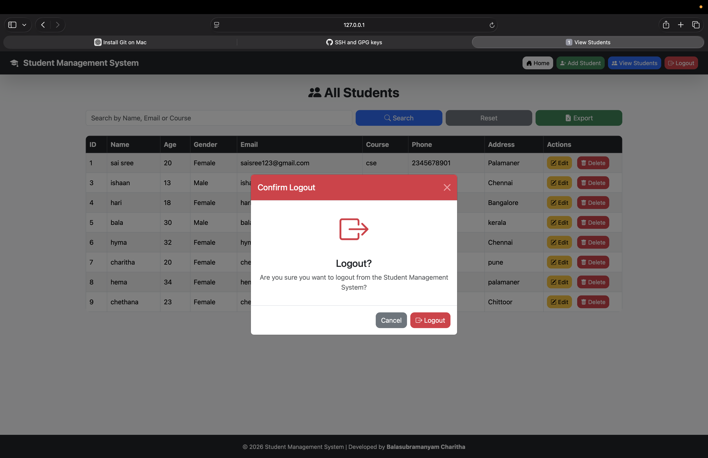

# 🎓 Student Management System

A full-stack Student Management System developed using **Python, Flask, MySQL, HTML, CSS, JavaScript, and Bootstrap**. This application allows administrators to manage student records efficiently through CRUD (Create, Read, Update, Delete) operations.

---

## 🚀 Features

- 🔐 Admin Login & Logout
- 📊 Dashboard with Student Statistics
- ➕ Add New Student
- 📋 View All Students
- 🔍 Search Students by Name, Email, or Course
- ✏️ Edit Student Details
- 🗑️ Delete Student Records
- ✅ Form Validation
- 📧 Duplicate Email Validation
- 📤 Export Student Data to Excel
- 💬 Flash Messages for User Feedback
- 🔒 Protected Routes (Login Required)
- 📱 Responsive User Interface using Bootstrap

---

## 🛠️ Technologies Used

### Frontend
- HTML5
- CSS3
- Bootstrap 5
- JavaScript

### Backend
- Python
- Flask

### Database
- MySQL

---

## 📂 Project Structure

```text
Student-Management-System-Flask/
│── backend/
│   ├── app.py
│   ├── models.py
│   ├── requirements.txt
│   └── .venv/
│
│── frontend/
│   ├── templates/
│   ├── static/
│
│── screenshots/
│── README.md
```

---

## ⚙️ Installation

### Clone the repository

```bash
git clone git@github.com:charitha06ui/Student-Management-System-Flask.git
```

### Go to the project folder

```bash
cd Student-Management-System-Flask
```

### Install dependencies

```bash
pip install -r backend/requirements.txt
```

### Run the application

```bash
cd backend
python app.py
```

---

## 📸 Screenshots

### 🏠 Home Page


### ➕ Add Student


### 📋 View Students


### ✏️ Edit Student


### 🗑️ Delete Student


### 📤 Export to Excel


### 🚪 Logout


---

## 🎯 Future Improvements

- Student Photo Upload
- Role-Based Authentication
- Email Notifications
- REST API Integration
- Pagination
- Dark Mode

---

## 👨‍💻 Author

**Balasubramanyam Charitha**

- GitHub: https://github.com/charitha06ui

---

⭐ If you like this project, consider giving it a star on GitHub!